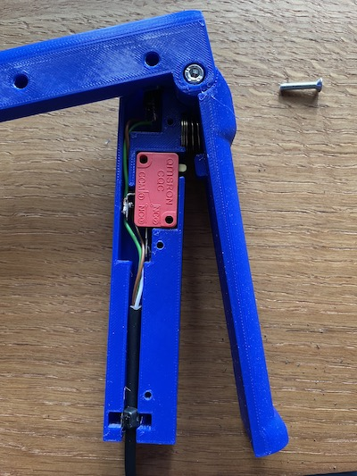

# slvctrl-buttons

Simple code for two input buttons to use as a kill switch or for some interraction

## Schema

## Usage ideas

### Dead-man handle

You can print the attached 3D files with a panel swtitch (optional), a
end of run switch, a spring and 1 m4 + 3  M3 screws to create a
dead-man handle that you can use to disable some actions in your
automation if the person holding the handle drops it.

## Required libraries
* https://github.com/ppedro74/Arduino-SerialCommands
* https://github.com/thomasfredericks/Bounce2
